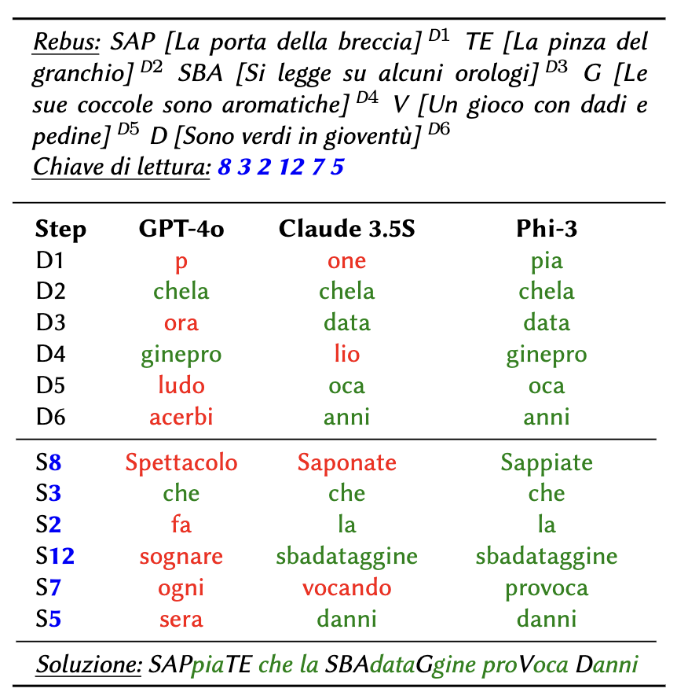

# Non Verbis, Sed Rebus: Large Language Models are Weak Solvers of Italian Rebuses

[Gabriele Sarti](https://gsarti.com) • [Tommaso Caselli](https://scholar.google.com/citations?user=fxQvP_QAAAAJ) • [Malvina Nissim](https://malvinanissim.github.io/) • [Arianna Bisazza](https://www.cs.rug.nl/~bisazza/)

<p float="left">
    
    
</p>

> **Abstract:** Rebuses are puzzles requiring constrained multi-step reasoning to identify a hidden phrase from a set of images and letters. In this work, we introduce a large collection of verbalized rebuses for the Italian language and use it to assess the rebus-solving capabilities of state-of-the-art large language models. While general-purpose systems such as LLaMA-3 and GPT-4o perform poorly on this task, ad-hoc fine-tuning seems to improve models' performance. However, we find that performance gains from training are largely motivated by memorization. Our results suggest that rebus solving remains a challenging test bed to evaluate large language models' linguistic proficiency and sequential instruction-following skills.

This repository contains scripts and notebooks associated with the paper ["Non Verbis, Sed Rebus: Large Language Models are Weak Solvers of Italian Rebuses"](https://arxiv.org/abs/2408.00584). If you use any of the following contents for your work, we kindly ask you to cite our paper:

```bibtex
@inproceedings{sarti-etal-2024-verbis,
    author = "Sarti, Gabriele and Caselli, Tommaso and Nissim, Malvina and Bisazza, Arianna",
    title = "Non Verbis, Sed Rebus: Large Language Models are Weak Solvers of Italian Rebuses",
    editor = "Dell'Orletta, Felice and Lenci, Alessandro and Montemagni, Simonetta and Sprugnoli, Rachele",
    booktitle = "Proceedings of the 10th Italian Conference on Computational Linguistics",
    series = "CEUR Workshop Proceedings",
    publisher = "CEUR-WS.org",
    year = "2024",
    url = "https://ceur-ws.org/Vol-3878/96_main_long.pdf",
    address = "Pisa, Italy",
    month = dec
}

@inproceedings{sarti-etal-2024-eurekarebus,
    author = "Sarti, Gabriele and Caselli, Tommaso and Bisazza, Arianna and Nissim, Malvina",
    title = "EurekaRebus - Verbalized Rebus Solving with LLMs: A CALAMITA Challenge",
    editor = "Dell'Orletta, Felice and Lenci, Alessandro and Montemagni, Simonetta and Sprugnoli, Rachele",
    booktitle = "Proceedings of the 10th Italian Conference on Computational Linguistics: CALAMITA Challenge",
    series = "CEUR Workshop Proceedings",
    publisher = "CEUR-WS.org",
    year = "2024",
    url = "https://ceur-ws.org/Vol-3878/132_calamita_long.pdf",
    address = "Pisa, Italy",
    month = dec
}
```

All models and data used in this work are available in our [🤗 Hub Collection](https://huggingface.co/collections/gsarti/verbalized-rebus-clic-it-2024-66ab8f11cb04e68bdf4fb028).

**New (December 2024):** Data for the [EurekaRebus](https://ceur-ws.org/Vol-3878/132_calamita_long.pdf) CALAMITA Challenge were released on the [Hugging Face Hub](https://huggingface.co/datasets/gsarti/eureka-rebus-calamita-2024)

## Try it yourself! 🧩

We provide a simple online demo to test the rebus-solving capabilities of our model. You can access it [here](https://huggingface.co/spaces/gsarti/verbalized-rebus-solver).

## Installation

To install the required dependencies, you can use the following command:

```bash
python3 -m venv venv
source venv/bin/activate
pip install -r requirements.txt
```

To run [training and inference notebooks](./notebooks) you will need a machine with access to a GPU (required by [Unsloth](https://github.com/unslothai/unsloth)). The environment setup is performed in the first cell of the training notebooks.

## Model performances

| Model | Setup | Crossword Definitions | First Pass EM | Solution EM |
|---|---|---|---|---|
| LLaMA-3 70B | 5-shot prompt | 0.22 | 0.04 | 0.00 |
| Qwen-2 72B | 5-shot prompt | 0.28 | 0.04 | 0.00 |
| GPT-4o | 5-shot prompt | 0.55 | 0.15 | 0.11 |
| Claude-3.5 Sonnet | 5-shot prompt | 0.66 | 0.28 | 0.24 |
| Gemma-2 2B (ours) | fine-tuned | 0.78 | 0.43 | 0.36 |
| Phi-3 3.8B (ours) | fine-tuned | 0.84 | 0.56 | 0.51 |
| LLaMA-3.1 8B (ours) | fine-tuned | **0.85** | **0.59** | **0.56** |

Fine-grained verbalized rebus solving performances of various LLMs. **Bold** denotes best overall performances. See the paper for more details.

## Reproducing the paper results

### Data preprocessing

> ⚠️ Refer to the [EurekaRebus]([eureka-rebus/README.md](https://huggingface.co/datasets/gsarti/eureka-rebus)) dataset card for more information on the dataset and the [data licensing](https://huggingface.co/datasets/gsarti/eureka-rebus/raw/main/LICENSE).

Run the following command to produce all data contained in the `eureka-rebus` folder from the `rebus.csv` file:

```shell
python scripts/process_data.py \
  --print_stats \
  --infer_punctuation \
  --generate_filtered_rebuses \
  --create_train_test_sets \
  --save_word_frequencies_train \
  --save_sharegpt_files
```

### Fine-tuning LLMs on EurekaRebus

Follow the notebooks [train_phi3_mini](notebooks/train_phi3_mini.ipynb) and [train_llama3.1_8b](notebooks/train_llama3.1_8b.ipynb) to fine-tune the models on the EurekaRebus dataset. The training of both models was conducted on a single RTX 3090 GPU with 24GB RAM.

### Generating and Parsing Rebus Solutions with Fine-tuned Models

To generate solutions for the rebuses in the test set, follow the instructions in the [inference](notebooks/inference.ipynb) notebook. The folder [outputs](outputs) already contains parsed [gold solutions](outputs/test_gold_id_ood.csv) and model predictions across saved training checkpoints for Phi-3 Mini and LLaMA-3.1 8B.

### Generating Rebus Solutions with Prompted LLMs

Use the [prompt_models](scritps/prompt_models.py) script to generate solutions for the rebuses in the test set using prompted LLMs. The script requires the `guidance` library to be installed. The following command generates solutions for the test set using the `Claude 3.5 Sonnet` model:

```shell
python scripts/prompt_models.py \
  --model claude \
  --api_key YOUR_ANTHROPIC_API_KEY
```

Resulting files have the same format as the ones produced by the inference notebook, and are saved in the `outputs/prompted_models` folder.

⚠️ Due to an incompatibility of the `guidance` library, we used `guidance=0.1.14` for `TogetherAI` models (LLaMA, Qwen) and `guidance=0.1.15` for proprietary models (Claude, GPT-4o). We don't guarantee that other versions will work as expected.

### Evaluating Results

For a new file containing the parsed predictions for a model produced with the inference notebook, you can compute all metrics from the paper using the following command:

```shell
python scripts/evaluate.py \
  --predicted_outputs outputs/phi3_mini/phi3_mini_results_step_500.csv \
  --gold_outputs outputs/test_gold_id_ood.csv \
  --word_frequencies outputs/word_frequencies_paisa.json \
  --word_frequencies_fp_train eureka-rebus/word_frequencies_fp_train.json \
  --word_frequencies_solution_train eureka-rebus/word_frequencies_solution_train.json \
  --do_corrs
```

To use the command above, if you use the `do_corrs` option, you should unzip the `word_frequencies_paisa.json.zip` file in the `outputs` folder.

### Acknowledgments

We would like to thank the [Associazione Culturale "Biblioteca Enigmistica Italiana - G. Panini"](http://www.enignet.it/home) for their valuable contribution in maintaining the Eureka5 collection up to date and openly accessible.
